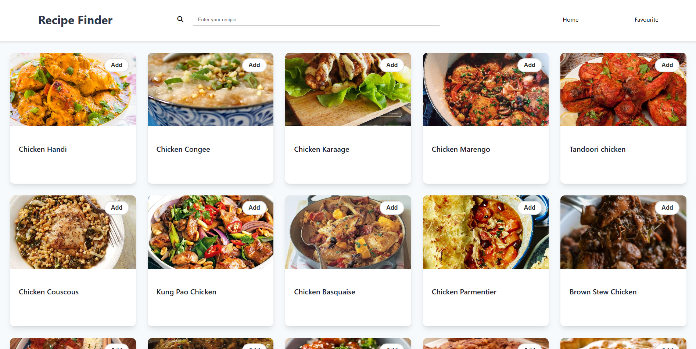
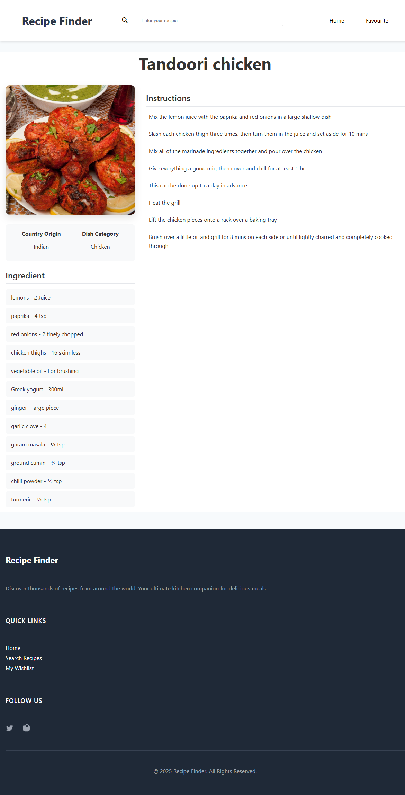

# 🍽️ Recipe Finder  

A React + TypeScript application to search, discover, and save your favourite recipes using [TheMealDB API](https://www.themealdb.com/).  

Users can:  
- 🔍 Search recipes by name or ingredients  
- 🎲 Explore random recipes  
- ❤️ Add/remove meals from their favourites (wishlist)  
- 📖 View detailed recipe pages with ingredients & instructions  

---

## 🚀 Features
- **React + TypeScript** for type safety and modular structure  
- **React Router v6** for navigation (`Home`, `Search`, `Favourite`, `Recipe Page`)  
- **TanStack Query (React Query)** for data fetching & caching  
- **Context API** for global state management (recipe search & wishlist)  
- **Responsive UI** with clean CSS styling  
- **Custom Loader** for a polished loading state  

---

## 🛠️ Tech Stack
- ⚛️ React 18  
- 🟦 TypeScript  
- 🌐 React Router DOM  
- 📡 TanStack React Query  
- 🎨 Custom CSS  

---

## 📂 Project Structure
```
src/
│── Components/
│   ├── Card.tsx
│   ├── Favourite.tsx
│   ├── Header.tsx
│   ├── Footer.tsx
│   ├── Home.tsx
│   ├── Loader/
│   │   └── Loader.tsx
│   │   └── Loader.css
│   ├── RecipePage/
│   │   └── RecipePage.tsx
│   │   └── RecipePage.css
│   └── Searched.tsx
│
│── Context/
│   ├── userContext.ts
│   └── userContextProvider.tsx
│
│── App.tsx
│── index.tsx
│── index.css
│── main.tsx
```

---

## ⚡ Getting Started

### 1. Clone the repository
```bash
git clone https://github.com/VinayPratap07/RecipeFinder.git
cd RecipeFinder
```

### 2. Install dependencies
```bash
npm install
```

### 3. Start development server
```bash
npm run dev
```

### 4. Build for production
```bash
npm run build
```

---

## 🔑 API Used
- [TheMealDB](https://www.themealdb.com/api.php) – free API for meal recipes  

Example endpoints:  
- Random meal → `https://www.themealdb.com/api/json/v1/1/random.php`  
- Search by name → `https://www.themealdb.com/api/json/v1/1/search.php?s=Arrabiata`  
- Lookup by ID → `https://www.themealdb.com/api/json/v1/1/lookup.php?i=52772`   

---

## 📸 Screenshots 



---

## 🤝 Contributing
Contributions, issues, and feature requests are welcome!  
Feel free to open a PR or suggest improvements.  

---

## 📜 License
This project is **open-source** under the MIT License.  
